# PR0 as a Platform - Visual Overview

```mermaid
graph TB
    subgraph "PR0 Hook Foundation"
        A[UserPromptSubmit Hook]
        B[PreToolUse Hook]
        C[PostToolUse Hook]
        D[Stop Hook]
    end
    
    subgraph "Immediate Value"
        E[❌ TODO Blocking]
        F[📝 Auto Documentation]
        G[🔒 Security Scanning]
        H[📊 Progress Tracking]
    end
    
    subgraph "Future Possibilities"
        I[🏢 Enterprise Compliance]
        J[🤖 AI Code Review]
        K[📈 Performance Analysis]
        L[🌍 Multi-Language Support]
        M[📚 Learning Platform]
        N[🔗 Tool Integrations]
    end
    
    subgraph "Community Ecosystem"
        O[Hook Marketplace]
        P[Domain Packages]
        Q[Custom Solutions]
    end
    
    A --> E
    B --> E
    B --> G
    C --> F
    C --> H
    D --> H
    
    A -.-> I
    B -.-> J
    C -.-> K
    A -.-> L
    D -.-> M
    C -.-> N
    
    I --> O
    J --> O
    K --> P
    L --> P
    M --> Q
    N --> Q
    
    style A fill:#e1f5fe
    style B fill:#fff3e0
    style C fill:#e8f5e9
    style D fill:#f3e5f5
    style E fill:#ffcdd2
    style O fill:#c8e6c9
```

## The Platform Vision

### Today (PR0)
- Quality enforcement
- TODO prevention
- Progress tracking
- Context loading

### Tomorrow (Community Extensions)
- Security scanners
- Compliance checkers
- Performance analyzers
- Documentation generators

### Future (Ecosystem)
- Hook marketplace
- Enterprise packages
- Domain-specific solutions
- AI-powered enhancements

## Why This Matters

**Without PR0**: BMAD-Method is a great framework with fixed capabilities

**With PR0**: BMAD-Method becomes a **platform** where:
- Users can add features without forking
- Enterprises can ensure compliance
- Communities can share enhancements
- Innovation happens at the edges

## One Decision, Infinite Possibilities

Accepting PR0 isn't just adding a feature - it's enabling a future where BMAD-Method can evolve and adapt to any need without compromising its core.